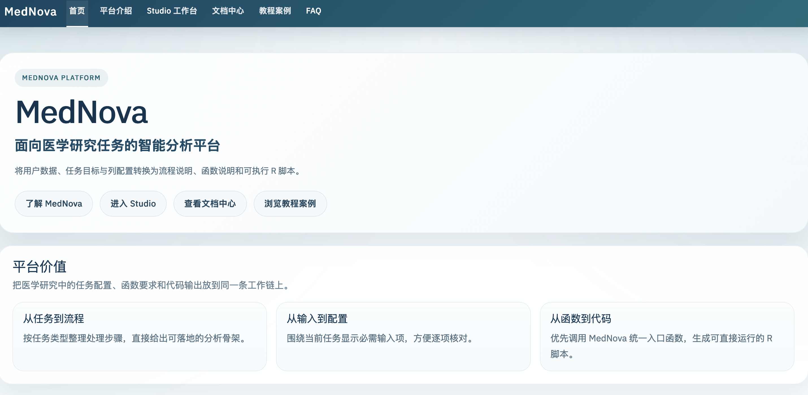
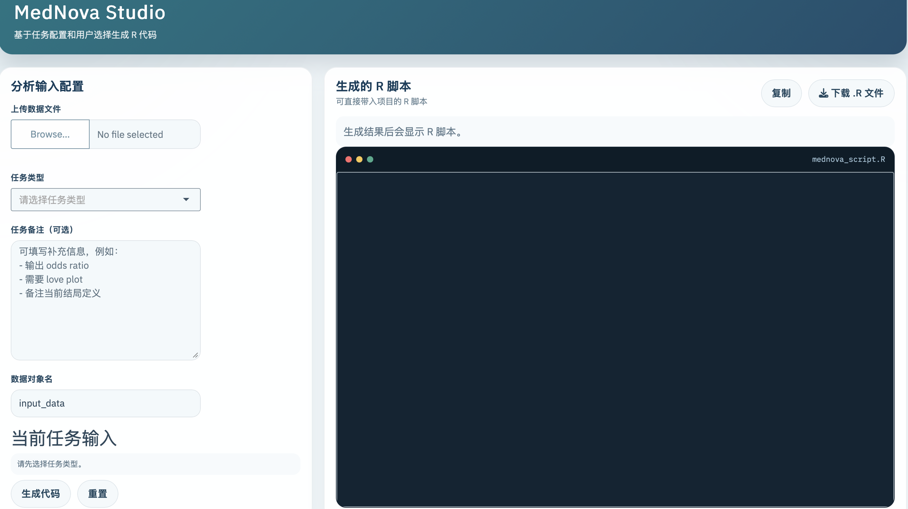

MedNova Platform

面向医学研究任务的智能分析平台

将用户数据、任务目标与列配置转换为流程说明、函数说明与可执行 R 脚本。

[进入 Studio](https://example.com/MedNova/articles/mednova-studio.md)
[查看文档中心](https://example.com/MedNova/articles/mednova-docs-center.md)
[浏览教程案例](https://example.com/MedNova/articles/mednova-cases.md)

**6 类任务** 覆盖 PSM、Logistic、Cox、差异表达、MR 与诊断模型。

**统一入口** 优先使用 \`med\_\*\`
主接口生成脚本，不把底层函数直接推到前台。

**只生成代码** 平台输出流程说明、函数要求与 R 脚本，不自动执行分析。

Platform Snapshot v1.0

任务配置 函数输入 R 脚本生成

## MedNova Studio

交互式工作台，集中处理数据上传、任务选择、字段配置和脚本导出。

## MedNova Docs

函数说明、数据要求、工作台用法和常见问题统一收录在文档中心。

## MedNova Cases

按场景整理 PSM、Logistic、Cox、MR 和诊断模型的示例路径。

## 启动方式

`run_mednova_app()`

平台价值

## 把医学研究中的任务配置、函数要求和代码输出放到同一条工作链上

信息清晰、路径统一，适合在分析开始前快速完成方案整理和脚本准备。

### 从任务到流程

按任务类型整理分析步骤，先确定工作路径，再组织脚本结构。

### 从输入到配置

围绕当前任务展示所需字段，减少无关输入，方便逐项核对。

### 从函数到代码

将统一入口函数、输入要求和流程步骤整合成一段可直接运行的 R 脚本。

平台能力

## 当前支持的任务与输出模块

平台以常见医学研究场景为主，优先提供清晰、稳定、可复核的脚本生成能力。

### 倾向评分匹配

组织匹配、平衡核对、baseline table 和 love plot 输出脚本。

### Logistic 回归

支持二分类结局建模、OR 输出与回归流程整理。

### Cox 回归

围绕时间列、事件列与预测变量生成生存分析脚本。

### 差异表达分析

组织 Bulk RNA 的分组整理、过滤、limma 分析与结果查看。

### 孟德尔随机化

连接 exposure / outcome 处理、协调和 MR 主流程。

### 诊断模型构建

支持模型、性能输出与 ROC 相关结果组织。

### 可视化输出

联动生成 love plot、forest plot、ROC 与火山图等常见图形脚本。

使用流程

## 从上传数据到导出脚本，入口统一，路径清楚

1

### 上传数据

导入 \`.csv\`、\`.tsv\`、\`.xlsx\` 或 \`.rds\` 文件。

2

### 选择任务

用任务类型决定当前工作流和需要显示的输入项。

3

### 配置当前任务输入

只填写当前任务真正需要的列和参数。

4

### 核对函数输入

查看主函数、当前映射与仍缺少的关键字段。

5

### 生成并下载 R 脚本

导出完整脚本，进入项目环境继续人工复核与执行。

工作台预览

## 平台首页与 Studio 工作台分工清楚，入口和使用界面各自独立

平台首页负责产品介绍和入口分流，Studio
负责任务配置、输入核对和代码输出。两张界面图分别展示平台门面和实际工作台，角色不会再混在一起。

- 平台首页：展示定位、能力模块、使用流程和核心入口
- 左侧：数据文件、任务类型、任务备注与当前任务输入
- 中部：输入数据信息、函数处理流程、函数输入要求
- 右侧：完整 R 脚本、复制按钮和下载 \`.R\` 按钮

[查看 Studio
说明](https://example.com/MedNova/articles/mednova-studio.md)
[查看启动方式](https://example.com/MedNova/reference/run_mednova_app.md)

平台首页

**等待平台首页截图**

将平台首页截图保存为 `docs/assets/images/platform-preview.png`
后，这里会自动显示正式预览图。

平台首页预览图读取自 `docs/assets/images/platform-preview.png`。

Studio 工作台

**等待 Studio 截图**

将 Studio 工作台截图保存为 `docs/assets/images/studio-preview.png`
后，这里会自动显示正式预览图。

工作台预览图读取自 `docs/assets/images/studio-preview.png`。

开始使用

## 从平台首页进入工作台、文档中心和教程案例

首页负责产品介绍和入口分流，文档中心负责说明，Studio
负责配置与代码生成。

[进入 Studio](https://example.com/MedNova/articles/mednova-studio.md)
[查看文档中心](https://example.com/MedNova/articles/mednova-docs-center.md)
[浏览教程案例](https://example.com/MedNova/articles/mednova-cases.md)
